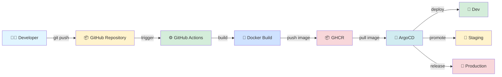
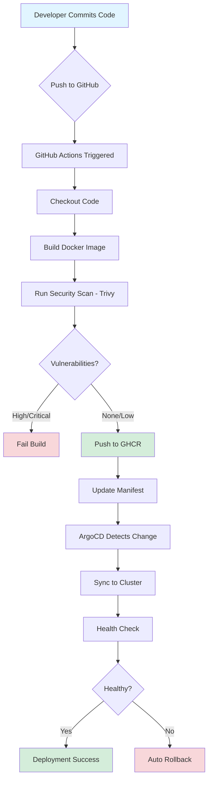

<div align="center">

# 🚀 Kubernetes Multi-Cluster GitOps Platform

### Production-Ready Kubernetes GitOps Template for AWS EKS

**Powered by Terraform, ArgoCD, Helm, and GitHub Actions**

A complete, battle-tested GitOps platform that anyone can fork, customize, and deploy to AWS in under 30 minutes.

[](https://opensource.org/licenses/MIT)
[](https://kubernetes.io/)
[](https://www.terraform.io/)
[](https://argo-cd.readthedocs.io/)
[](https://aws.amazon.com/eks/)
[](https://helm.sh/)
[](https://www.docker.com/)
[](https://github.com/features/actions)

[**📚 Quick Start**](#-quick-start) • [**📖 Documentation**](#-documentation) • [**🎓 Learn**](#-skills-youll-learn) • [**🤝 Contributing**](#-contributing)

---

</div>

## 📋 Table of Contents

- [Why This Template?](#-why-this-template)
- [Who Is This For?](#-who-is-this-for)
- [Features](#-features)
- [Architecture](#-architecture)
- [Tech Stack](#-tech-stack)
- [Quick Start](#-quick-start)
- [Project Structure](#-project-structure)
- [Customization Guide](#-customization-guide)
- [Deployment Pipeline](#-deployment-pipeline)
- [Security](#-security)
- [Cost Estimation](#-cost-estimation)
- [Troubleshooting](#-troubleshooting)
- [Skills You'll Learn](#-skills-youll-learn)
- [Documentation](#-documentation)
- [Roadmap](#-roadmap)
- [Contributing](#-contributing)
- [Support](#-support)
- [License](#-license)
- [Author](#-author)

---

## 🎯 Why This Template?

Building a production-ready Kubernetes platform from scratch is **complex**, **time-consuming**, and **error-prone**.

This template gives you:

| ❌ Without This Template | ✅ With This Template |
|--------------------------|----------------------|
| Spend weeks researching best practices | Production-ready in 30 minutes |
| Trial and error with configurations | Battle-tested configurations included |
| Security vulnerabilities from misconfigurations | Built-in security best practices |
| Manual infrastructure setup | Fully automated with Terraform |
| No CI/CD pipeline | Complete GitHub Actions workflow |
| Difficult to scale | Auto-scaling configured |
| No documentation | Comprehensive guides included |
| Learning curve of 2-3 months | Start deploying on Day 1 |

### 🎁 What You Get

✅ **Complete Infrastructure** - Terraform code for AWS EKS with IAM roles  
✅ **GitOps Pipeline** - ArgoCD configured for automated deployments  
✅ **CI/CD Workflow** - GitHub Actions pipeline with security scanning  
✅ **Production Security** - Non-root containers, resource limits, vulnerability scanning  
✅ **Auto-Scaling** - Horizontal Pod Autoscaler configured  
✅ **Multi-Arch Support** - Builds for amd64 and arm64  
✅ **Complete Documentation** - 2,344 lines of guides, examples, and troubleshooting  
✅ **Beginner-Friendly** - Step-by-step instructions with inline comments  

> **Think of this as a Kubernetes Platform Starter Kit** - just like `create-react-app` or `rails new`, but for cloud-native infrastructure.

---

## 👥 Who Is This For?

This template is designed for:

### 🎓 Students & Beginners
Learn Kubernetes, GitOps, and DevOps practices with a real-world project for your resume and portfolio.

### 💼 DevOps Engineers
Quickly set up a GitOps platform without reinventing the wheel. Focus on customization, not boilerplate.

### 🏗️ Platform Engineers
Use as a foundation for your organization's internal Kubernetes platform. Extend and customize as needed.

### ☁️ Cloud Engineers
Deploy production-ready infrastructure on AWS with proven best practices and security configurations.

### 🚨 SRE Engineers
Get a reliable, self-healing deployment platform with health checks, monitoring hooks, and auto-recovery.

### 🏢 Engineering Teams
Standardize your Kubernetes deployments across dev, staging, and production environments.

### 🔬 Architects
Use as a reference architecture for designing cloud-native platforms and GitOps workflows.

---

## ✨ Features

### 🏗️ Infrastructure
- **AWS EKS 1.31** - Latest stable Kubernetes cluster
- **Terraform 1.9+** - Infrastructure as Code with complete IAM configuration
- **Automated VPC Setup** - Optional VPC creation with public/private subnets
- **Node Auto-Scaling** - Configurable node groups with auto-scaling

### 🔄 GitOps
- **ArgoCD v1beta1** - Declarative GitOps continuous delivery
- **Automated Sync** - Self-healing deployments with health monitoring
- **Multi-Cluster Support** - Deploy to dev, staging, and production clusters
- **Rollback Capability** - Easy rollback to previous versions

### 🔒 Security
- **Non-Root Containers** - All containers run as non-root users
- **Security Contexts** - Dropped capabilities and read-only file systems
- **Resource Limits** - CPU and memory limits configured
- **Trivy Scanning** - Automated vulnerability scanning in CI/CD
- **IAM Best Practices** - Least-privilege IAM roles for EKS
- **.gitignore Protection** - Prevents accidental secret commits

### 🚀 CI/CD
- **GitHub Actions v4** - Modern CI/CD pipeline
- **Multi-Arch Builds** - Support for amd64 and arm64
- **Docker Buildx v6** - Efficient layer caching
- **GHCR Integration** - GitHub Container Registry for images
- **Automated Testing** - Build validation and security scans

### 📦 Deployment
- **Helm 3 Charts** - Templated application deployments
- **Health Probes** - Liveness and readiness checks
- **Rolling Updates** - Zero-downtime deployments
- **HPA** - Horizontal Pod Autoscaler for dynamic scaling
- **Service Discovery** - Kubernetes DNS and service mesh ready

### 📊 Monitoring Ready
- **Structured Logging** - Container logs with kubectl/CloudWatch
- **Metrics Server** - HPA metrics collection
- **Prometheus Ready** - Metrics endpoints exposed
- **Health Endpoints** - Application health monitoring

### 📈 Scalability
- **Horizontal Scaling** - Scale pods based on CPU/memory
- **Node Auto-Scaling** - EKS node group auto-scaling
- **Multi-Zone Deployment** - High availability across AZs
- **Load Balancing** - AWS Load Balancer Controller compatible

---

## 🏛️ Architecture

### High-Level Workflow



### Detailed Architecture

```
┌─────────────────────────────────────────────────────────────┐
│                       Developer                             │
│              Commits code to GitHub                         │
└────────────────────┬────────────────────────────────────────┘
                     │
                     ▼
┌─────────────────────────────────────────────────────────────┐
│                  GitHub Repository                          │
│            Version Control & Source of Truth                │
└────────────────────┬────────────────────────────────────────┘
                     │
                     ▼
┌─────────────────────────────────────────────────────────────┐
│                  GitHub Actions (CI/CD)                     │
│  • Checkout code          • Run tests                       │
│  • Build Docker image     • Scan for vulnerabilities        │
│  • Multi-arch build       • Push to GHCR                    │
└────────────────────┬────────────────────────────────────────┘
                     │
                     ▼
┌─────────────────────────────────────────────────────────────┐
│                Docker Build (Buildx v6)                     │
│  • amd64 architecture     • Layer caching                   │
│  • arm64 architecture     • Security scanning               │
└────────────────────┬────────────────────────────────────────┘
                     │
                     ▼
┌─────────────────────────────────────────────────────────────┐
│            GitHub Container Registry (GHCR)                 │
│         Stores versioned container images                   │
└────────────────────┬────────────────────────────────────────┘
                     │
                     ▼
┌─────────────────────────────────────────────────────────────┐
│                    ArgoCD (GitOps)                          │
│  • Monitors Git repository    • Self-healing                │
│  • Detects manifest changes   • Auto-sync                   │
│  • Pulls container images     • Health monitoring           │
└────────────────────┬────────────────────────────────────────┘
                     │
     ┌───────────────┼───────────────┬───────────────┐
     ▼               ▼               ▼               ▼
┌──────────┐  ┌──────────┐  ┌──────────┐  ┌──────────┐
│   Dev    │  │ Staging  │  │   Prod   │  │  Other   │
│ Cluster  │  │ Cluster  │  │ Cluster  │  │ Clusters │
│          │  │          │  │          │  │          │
│ EKS 1.31 │  │ EKS 1.31 │  │ EKS 1.31 │  │ EKS 1.31 │
└──────────┘  └──────────┘  └──────────┘  └──────────┘
```

### Component Responsibilities

| Component | Responsibility | Technology |
|-----------|----------------|------------|
| **Developer** | Writes code and commits to Git | Git, IDE |
| **GitHub** | Version control and collaboration | GitHub |
| **GitHub Actions** | Automated CI/CD pipeline | GitHub Actions v4 |
| **Docker Build** | Container image creation | Docker Buildx v6 |
| **GHCR** | Container image storage | GitHub Container Registry |
| **ArgoCD** | GitOps deployment automation | ArgoCD v1beta1 |
| **Kubernetes** | Container orchestration | AWS EKS 1.31 |
| **Terraform** | Infrastructure provisioning | Terraform 1.9+ |

---

## 🔧 Tech Stack

| Category | Technology | Version | Purpose |
|----------|-----------|---------|---------|
| **Container Orchestration** | Kubernetes (AWS EKS) | 1.31 | Manage containerized applications |
| **GitOps** | ArgoCD | v1beta1 | Automated continuous delivery |
| **Infrastructure as Code** | Terraform | 1.9+ | AWS infrastructure provisioning |
| **Cloud Provider** | Amazon Web Services | - | EKS, IAM, VPC, Load Balancers |
| **Package Manager** | Helm | 3.x | Application templating |
| **CI/CD** | GitHub Actions | v4 | Automated build and test |
| **Container Runtime** | Docker | Latest | Container builds |
| **Build Tool** | Docker Buildx | v6 | Multi-architecture builds |
| **Container Registry** | GHCR | - | Image storage |
| **Security Scanner** | Trivy | Latest | Vulnerability detection |
| **Example App** | NGINX | 1.27-alpine | Demo application |

---

## 🚀 Quick Start

### Prerequisites

Before you begin, ensure you have the following installed and configured:

| Tool | Version | Installation Guide | Purpose |
|------|---------|-------------------|---------|
| **AWS CLI** | Latest | [Install AWS CLI](https://docs.aws.amazon.com/cli/latest/userguide/getting-started-install.html) | Interact with AWS services |
| **AWS Account** | - | [Create Account](https://aws.amazon.com/free/) | Host your infrastructure |
| **Terraform** | 1.9+ | [Install Terraform](https://developer.hashicorp.com/terraform/downloads) | Provision infrastructure |
| **kubectl** | 1.31+ | [Install kubectl](https://kubernetes.io/docs/tasks/tools/) | Manage Kubernetes |
| **Helm** | 3.x | [Install Helm](https://helm.sh/docs/intro/install/) | Deploy applications |
| **Git** | Latest | [Install Git](https://git-scm.com/downloads) | Version control |

#### Verify Installation

```bash
# Check AWS configuration
aws --version
aws sts get-caller-identity

# Check Terraform
terraform --version

# Check kubectl
kubectl version --client

# Check Helm
helm version
```

---

### Step 1: Fork and Clone

1. **Fork this repository** - Click the "Fork" button at the top of this page
2. **Clone your fork**:
   ```bash
   git clone https://github.com/YOUR-USERNAME/kubernetes-multi-cluster-gitops-platform.git
   cd kubernetes-multi-cluster-gitops-platform
   ```

---

### Step 2: Customize Configuration

#### 2.1 Update Repository URL

Edit `argocd/application.yaml`:

```yaml
# Line 9: Update with YOUR GitHub username
repoURL: https://github.com/YOUR-USERNAME/kubernetes-multi-cluster-gitops-platform.git  # 👈 CHANGE THIS
```

#### 2.2 Configure Terraform Variables

```bash
# Copy the example file
cp terraform/terraform.tfvars.example terraform/terraform.tfvars

# Edit with your AWS settings
nano terraform/terraform.tfvars  # or use your preferred editor
```

**Required variables:**

```hcl
aws_region         = "us-east-1"              # Your AWS region
cluster_name       = "my-eks-cluster"         # Your cluster name
vpc_id             = "vpc-xxxxx"              # Your VPC ID (or create new)
subnet_ids         = ["subnet-xxx", "subnet-yyy"]  # Your subnet IDs
```

> 📘 **Don't have a VPC?** See [docs/CREATE_VPC.md](docs/CREATE_VPC.md) for setup instructions.

#### 2.3 Customize Application (Optional)

Replace the NGINX example with your own application:

- **Dockerfile** - Add your application code
- **argocd/apps/nginx/deployment.yaml** - Update container image
- **argocd/apps/nginx/service.yaml** - Adjust service configuration

---

### Step 3: Provision Infrastructure

```bash
cd terraform

# Initialize Terraform
terraform init

# Preview changes
terraform plan

# Create infrastructure
terraform apply
# Type 'yes' when prompted

# Configure kubectl
aws eks update-kubeconfig --name my-eks-cluster --region us-east-1
```

**Expected output:**
```
Apply complete! Resources: 15 added, 0 changed, 0 destroyed.

Outputs:
cluster_endpoint = "https://xxxxx.eks.amazonaws.com"
cluster_name = "my-eks-cluster"
```

---

### Step 4: Install ArgoCD

```bash
# Create ArgoCD namespace
kubectl create namespace argocd

# Install ArgoCD
kubectl apply -n argocd -f https://raw.githubusercontent.com/argoproj/argo-cd/stable/manifests/install.yaml

# Wait for pods to be ready (2-3 minutes)
kubectl wait --for=condition=Ready pods --all -n argocd --timeout=300s
```

---

### Step 5: Deploy Application

```bash
# Deploy the NGINX example application
kubectl apply -f argocd/application.yaml

# Watch deployment status
kubectl get applications -n argocd -w
```

---

### Step 6: Access ArgoCD Dashboard

```bash
# Port-forward ArgoCD server
kubectl port-forward svc/argocd-server -n argocd 8080:443 &

# Get admin password
kubectl -n argocd get secret argocd-initial-admin-secret -o jsonpath="{.data.password}" | base64 -d && echo
```

Open browser: **https://localhost:8080**

- **Username:** `admin`
- **Password:** (output from command above)

---

### Step 7: Verify Deployment

```bash
# Check application status
kubectl get pods -n default

# Get application URL
kubectl get svc nginx-service -n default

# Test the application
curl http://<LOAD-BALANCER-URL>
```

---

### 🎉 Success!

You now have a production-ready GitOps platform running on AWS EKS!

**Next steps:**
- 📖 Read [docs/CUSTOMIZE.md](docs/CUSTOMIZE.md) to add your own applications
- 🔧 Explore [CHEATSHEET.md](CHEATSHEET.md) for common commands
- ❓ Check [docs/FAQ.md](docs/FAQ.md) for troubleshooting

---

## 📁 Project Structure

## 📁 Project Structure

```
kubernetes-multi-cluster-gitops-platform/
│
├── 📄 README.md                      # This file - project overview
├── 📄 QUICKSTART.md                  # 5-minute quick start guide
├── 📄 CHEATSHEET.md                  # Command reference and tips
├── 📄 CHANGELOG.md                   # Version history and changes
├── 📄 CONTRIBUTING.md                # Contribution guidelines
├── 📄 LICENSE                        # MIT license
├── 📄 .gitignore                     # Git ignore patterns
├── 🔧 setup.sh                       # Automated installation script
│
├── 📁 .github/                       # GitHub specific files
│   └── workflows/
│       └── ci-cd.yaml                # GitHub Actions CI/CD pipeline
│
├── 📁 terraform/                     # Infrastructure as Code
│   ├── eks.tf                        # EKS cluster configuration
│   ├── terraform.tfvars.example      # Configuration template
│   └── README.md                     # Terraform documentation
│
├── 📁 argocd/                        # ArgoCD GitOps configuration
│   ├── application.yaml              # ArgoCD application definition
│   └── apps/
│       └── nginx/                    # Example NGINX application
│           ├── deployment.yaml       # Kubernetes deployment
│           ├── service.yaml          # Kubernetes service
│           ├── hpa.yaml              # Horizontal Pod Autoscaler
│           └── helm-charts/
│               └── nginx-chart/      # Helm chart
│                   ├── Chart.yaml
│                   ├── values.yaml
│                   └── templates/
│                       ├── _helpers.tpl
│                       ├── deployment.yaml
│                       └── service.yaml
│
├── 📁 docs/                          # Additional documentation
│   ├── FAQ.md                        # Frequently asked questions
│   ├── CUSTOMIZE.md                  # Customization guide
│   └── CREATE_VPC.md                 # VPC creation guide
│
├── 🐳 Dockerfile                     # Container image definition
└── ⚙️ nginx.conf                     # NGINX configuration

```

### Key Directories Explained

| Directory | Purpose | When to Modify |
|-----------|---------|---------------|
| **`.github/workflows/`** | CI/CD automation with GitHub Actions | When customizing build/test pipeline |
| **`terraform/`** | AWS infrastructure provisioning | When deploying to your AWS account |
| **`argocd/`** | GitOps deployment configuration | When adding new applications |
| **`argocd/apps/nginx/`** | Example application manifests | Replace with your application |
| **`docs/`** | Extended documentation | For reference, no changes needed |

---

## 🎨 Customization Guide

### Required Changes

Before deploying, you **must** update these files:

#### 1. Repository URL

**File:** `argocd/application.yaml`

```yaml
spec:
  source:
    repoURL: https://github.com/YOUR-USERNAME/kubernetes-multi-cluster-gitops-platform.git  # 👈 CHANGE THIS
```

#### 2. AWS Configuration

**File:** `terraform/terraform.tfvars` (create from example)

```bash
cp terraform/terraform.tfvars.example terraform/terraform.tfvars
```

**Edit these values:**

```hcl
aws_region         = "us-east-1"                      # Your AWS region
cluster_name       = "my-eks-cluster"                 # Your cluster name
vpc_id             = "vpc-xxxxx"                      # Your VPC ID
subnet_ids         = ["subnet-xxx", "subnet-yyy"]     # Your subnet IDs
instance_type      = "t3.medium"                      # Node instance type
desired_capacity   = 2                                # Number of nodes
```

### Optional Customizations

#### 3. Replace Example Application

**Current:** NGINX web server (demo)  
**Goal:** Deploy your own application

**Files to update:**

| File | What to Change |
|------|---------------|
| `Dockerfile` | Replace with your app's Dockerfile |
| `argocd/apps/nginx/deployment.yaml` | Update container image, name, env vars |
| `argocd/apps/nginx/service.yaml` | Adjust ports and service type |
| `argocd/apps/nginx/hpa.yaml` | Tune scaling parameters |

**Example: Deploying a Node.js App**

```yaml
# argocd/apps/nginx/deployment.yaml
spec:
  containers:
  - name: my-nodejs-app                        # Change name
    image: ghcr.io/YOUR-USERNAME/my-app:latest # Change image
    ports:
    - containerPort: 3000                      # Change port
```

#### 4. Add Multiple Applications

Create new folders under `argocd/apps/`:

```bash
# Copy the NGINX template
cp -r argocd/apps/nginx argocd/apps/my-app

# Customize the new app
nano argocd/apps/my-app/deployment.yaml
```

#### 5. Multi-Environment Setup

Create environment-specific manifests:

```
argocd/apps/
├── nginx/
│   ├── base/              # Shared configuration
│   ├── dev/               # Development overrides
│   ├── staging/           # Staging overrides
│   └── production/        # Production overrides
```

📖 **Detailed guide:** See [docs/CUSTOMIZE.md](docs/CUSTOMIZE.md)

---

## 🔄 Deployment Pipeline

### Automated CI/CD Workflow



### Deployment Stages

| Stage | Action | Duration | On Failure |
|-------|--------|----------|------------|
| **1. Code Commit** | Developer pushes to GitHub | Instant | N/A |
| **2. CI Trigger** | GitHub Actions starts | < 5s | Notify developer |
| **3. Build** | Docker image built (multi-arch) | 2-5 min | Build fails, notify |
| **4. Scan** | Trivy security scan | 30s | Block if critical CVEs |
| **5. Push** | Image pushed to GHCR | 30s | Retry 3 times |
| **6. Sync** | ArgoCD detects change | 1-3 min | Auto-retry |
| **7. Deploy** | Pods created in Kubernetes | 1-2 min | Rollback previous version |
| **8. Health Check** | Readiness/liveness probes | 30s | Terminate unhealthy pods |

### Manual Deployment

If you prefer manual control:

```bash
# Build and push manually
docker buildx build --platform linux/amd64,linux/arm64 \
  -t ghcr.io/YOUR-USERNAME/my-app:latest \
  --push .

# Update manifest
kubectl set image deployment/nginx-deployment \
  nginx=ghcr.io/YOUR-USERNAME/my-app:latest

# Or sync via ArgoCD CLI
argocd app sync nginx-app
```

---

## 🔒 Security

This template implements multiple security layers:

### 1. Container Security

**Non-Root User**
```yaml
securityContext:
  runAsNonRoot: true
  runAsUser: 1000
  fsGroup: 2000
```

**Dropped Capabilities**
```yaml
securityContext:
  capabilities:
    drop:
      - ALL
```

**Read-Only Filesystem**
```yaml
securityContext:
  readOnlyRootFilesystem: true
```

### 2. Resource Limits

Prevent resource exhaustion attacks:

```yaml
resources:
  requests:
    memory: "128Mi"
    cpu: "100m"
  limits:
    memory: "256Mi"
    cpu: "200m"
```

### 3. Image Scanning

Automated vulnerability scanning in CI/CD:

```yaml
- name: Run Trivy vulnerability scanner
  uses: aquasecurity/trivy-action@master
  with:
    severity: 'HIGH,CRITICAL'
    exit-code: '1'  # Fail build on vulnerabilities
```

### 4. IAM Best Practices

Least-privilege IAM roles:

- **EKS Cluster Role** - Minimum permissions for cluster management
- **Node Role** - EC2, ECR, CloudWatch access only
- **Service Account** - IRSA (IAM Roles for Service Accounts) ready

### 5. Network Security

- **Security Groups** - Restrict inbound/outbound traffic
- **Network Policies** - Control pod-to-pod communication (ready to enable)
- **Private Subnets** - Nodes in private subnets, NAT gateway for egress

### 6. Secrets Management

**Never commit secrets to Git!**

```bash
# Use Kubernetes Secrets
kubectl create secret generic my-secret \
  --from-literal=password='my-secure-password'

# Or AWS Secrets Manager
aws secretsmanager create-secret \
  --name my-app/password \
  --secret-string 'my-secure-password'
```

### 7. Security Checklist

- [ ] `.gitignore` prevents secret commits
- [ ] All containers run as non-root
- [ ] Resource limits configured
- [ ] Image scanning enabled in CI/CD
- [ ] IAM roles follow least-privilege
- [ ] Network policies defined (optional)
- [ ] Secrets externalized (not in Git)
- [ ] RBAC configured in ArgoCD
- [ ] TLS enabled for ingress (production)
- [ ] Audit logging enabled (production)

📖 **Learn more:** [Kubernetes Security Best Practices](https://kubernetes.io/docs/concepts/security/)

---

## 💰 Cost Estimation

### Monthly AWS Costs

| Resource | Configuration | Estimated Cost | How to Reduce |
|----------|--------------|----------------|---------------|
| **EKS Control Plane** | 1 cluster | $72/month | N/A - Fixed cost |
| **EC2 Instances** | 2x t3.medium | $60/month | Use t3.small ($30/month) |
| **EBS Volumes** | 100GB gp3 | $8/month | Reduce volume size |
| **Load Balancer** | 1 ALB | $16/month | Use NodePort for dev |
| **NAT Gateway** | 1 NAT (optional) | $32/month | Skip for dev environments |
| **Data Transfer** | Minimal | $5-10/month | Varies with usage |
| **Total (Dev)** | - | **$161-193/month** | **~$86/month (minimal)** |
| **Total (Production)** | 3+ nodes, Multi-AZ | **$300-500/month** | Use Savings Plans |

### 💡 Money-Saving Tips

#### For Development/Learning

```hcl
# terraform/terraform.tfvars
instance_type      = "t3.small"    # Instead of t3.medium
desired_capacity   = 1             # Instead of 2
skip_nat_gateway   = true          # Skip NAT gateway
```

#### Destroy When Not In Use

```bash
# Stop everything to avoid charges
terraform destroy

# Resume later
terraform apply
```

#### Use AWS Free Tier

- **750 hours/month** of t2.micro/t3.micro (first 12 months)
- **Note:** EKS control plane ($72/month) is **not** free tier eligible

### Cost Monitoring

```bash
# Check current AWS spend
aws ce get-cost-and-usage \
  --time-period Start=2024-01-01,End=2024-01-31 \
  --granularity MONTHLY \
  --metrics "BlendedCost"

# Set billing alerts
aws cloudwatch put-metric-alarm \
  --alarm-name billing-alarm \
  --alarm-threshold 100
```

---

## 🐛 Troubleshooting

### Common Issues

| Problem | Symptoms | Solution |
|---------|----------|----------|
| **AWS credentials not configured** | `Error: No valid credential sources found` | Run `aws configure` and enter credentials |
| **VPC/Subnet not found** | `Error: vpc-xxx not found` | Create VPC or update `terraform.tfvars` |
| **Terraform state locked** | `Error: state locked` | Wait 5 minutes or: `terraform force-unlock <ID>` |
| **kubectl can't connect** | `Unable to connect to server` | Run: `aws eks update-kubeconfig --name <cluster-name>` |
| **Pods stuck in Pending** | `kubectl get pods` shows Pending | Wait 2-3 minutes for nodes, check: `kubectl describe pod <name>` |
| **ArgoCD sync failed** | Application shows "OutOfSync" | Check `repoURL` in `application.yaml` matches your fork |
| **Can't access ArgoCD UI** | Port-forward fails | Check pods: `kubectl get pods -n argocd` |
| **Image pull errors** | `ErrImagePull` or `ImagePullBackOff` | Verify image exists: `docker pull <image>` |
| **Permission denied** | IAM errors in Terraform | Check AWS user has AdministratorAccess or EKS permissions |
| **Terraform apply fails** | Various resource creation errors | Check AWS service quotas and region availability |

### Debug Commands

```bash
# Check cluster status
kubectl cluster-info
kubectl get nodes

# Check pod logs
kubectl logs <pod-name>
kubectl logs <pod-name> --previous  # Previous container logs

# Describe resources
kubectl describe pod <pod-name>
kubectl describe node <node-name>

# Check events
kubectl get events --sort-by='.lastTimestamp'

# ArgoCD application status
kubectl get applications -n argocd
argocd app get <app-name>

# Terraform debug
terraform plan -out=tfplan
terraform show tfplan
TF_LOG=DEBUG terraform apply
```

### Getting Help

1. **📖 Check Documentation**
   - [FAQ.md](docs/FAQ.md) - 30+ common questions
   - [CUSTOMIZE.md](docs/CUSTOMIZE.md) - Customization guide
   - [CREATE_VPC.md](docs/CREATE_VPC.md) - VPC setup help

2. **🔍 Search Issues**
   - [Existing Issues](https://github.com/Subhasmita696/kubernetes-multi-cluster-gitops-platform/issues)
   - Someone may have solved your problem!

3. **💬 Ask the Community**
   - [Open a new issue](https://github.com/Subhasmita696/kubernetes-multi-cluster-gitops-platform/issues/new)
   - Provide: error message, `kubectl version`, `terraform version`, steps to reproduce

---

## 🎓 Skills You'll Learn

By deploying and customizing this platform, you'll gain hands-on experience with:

### Infrastructure & Cloud

- ☁️ **AWS EKS** - Managed Kubernetes service setup and management
- 🏗️ **Terraform** - Infrastructure as Code (IaC) principles and best practices
- 🌐 **AWS VPC** - Networking, subnets, security groups, and NAT gateways
- 🔐 **IAM** - Identity and access management for cloud resources

### Kubernetes & Orchestration

- ☸️ **Kubernetes** - Container orchestration fundamentals
- 📦 **kubectl** - Command-line tool for cluster management
- 📊 **Deployments** - Application deployment strategies
- 🔄 **Services** - Service discovery and load balancing
- 📈 **HPA** - Horizontal Pod Autoscaling
- 🏥 **Health Probes** - Liveness and readiness checks

### GitOps & CI/CD

- 🔄 **GitOps** - Declarative infrastructure and application management
- 🚀 **ArgoCD** - Continuous delivery for Kubernetes
- ⚙️ **GitHub Actions** - CI/CD pipeline automation
- 🔁 **Auto-Sync** - Self-healing deployments

### Containers & Images

- 🐳 **Docker** - Container image creation and optimization
- 🏗️ **Buildx** - Multi-architecture image builds
- 📦 **GHCR** - GitHub Container Registry usage
- 🔍 **Trivy** - Container vulnerability scanning

### Package Management

- ⚓ **Helm** - Kubernetes package manager
- 📑 **Charts** - Application templating and versioning
- 🎨 **Templates** - Kubernetes manifest templating

### DevSecOps

- 🔒 **Security Contexts** - Container security hardening
- 🛡️ **RBAC** - Role-based access control
- 🔐 **Secrets Management** - Secure credential handling
- 🔍 **Vulnerability Scanning** - Image security scanning

### Monitoring & Observability

- 📊 **Metrics** - Resource usage monitoring
- 📝 **Logging** - Application and system logs
- 🏥 **Health Checks** - Service health monitoring
- 📈 **Auto-Scaling** - Performance-based scaling

### Best Practices

- 📐 **12-Factor App** - Cloud-native application principles
- 🏭 **Production Readiness** - Reliability and resilience
- 📚 **Documentation** - Technical writing and knowledge sharing
- 🤝 **Open Source** - Contribution and collaboration

---

## 📚 Documentation

### Core Guides

| Document | Description | Best For |
|----------|-------------|----------|
| [**QUICKSTART.md**](QUICKSTART.md) | 5-minute quick start guide | First-time users |
| [**CHEATSHEET.md**](CHEATSHEET.md) | Command reference and tips | Daily operations |
| [**docs/FAQ.md**](docs/FAQ.md) | 30+ frequently asked questions | Troubleshooting |
| [**docs/CUSTOMIZE.md**](docs/CUSTOMIZE.md) | How to add your own apps | Customization |
| [**docs/CREATE_VPC.md**](docs/CREATE_VPC.md) | AWS VPC creation guide | AWS setup |
| [**CONTRIBUTING.md**](CONTRIBUTING.md) | Contribution guidelines | Contributors |
| [**CHANGELOG.md**](CHANGELOG.md) | Version history | What's new |

### External Resources

- 📘 [Kubernetes Official Docs](https://kubernetes.io/docs/)
- 📕 [ArgoCD Documentation](https://argo-cd.readthedocs.io/)
- 📗 [Terraform AWS Provider](https://registry.terraform.io/providers/hashicorp/aws/latest/docs)
- 📙 [AWS EKS Best Practices](https://aws.github.io/aws-eks-best-practices/)
- 📓 [Helm Documentation](https://helm.sh/docs/)
- 📔 [GitOps Principles](https://www.gitops.tech/)

---

## 🗺️ Roadmap

### ✅ Completed

- [x] AWS EKS cluster provisioning with Terraform
- [x] Complete IAM role configuration
- [x] ArgoCD GitOps setup
- [x] GitHub Actions CI/CD pipeline
- [x] Multi-architecture Docker builds
- [x] Security scanning with Trivy
- [x] Horizontal Pod Autoscaler
- [x] Production-grade security contexts
- [x] Comprehensive documentation (2,344 lines)
- [x] Automated setup script
- [x] Helm chart templates

### 🚧 In Progress

- [ ] Terraform modules for multi-cluster setup
- [ ] Kustomize overlays for environments
- [ ] Ingress controller configuration
- [ ] Cert-manager for TLS automation

### 🔮 Planned Features

#### Infrastructure
- [ ] **Multi-Region Support** - Deploy across multiple AWS regions
- [ ] **Disaster Recovery** - Automated backup and restore
- [ ] **Spot Instances** - Cost optimization with spot instances
- [ ] **AWS CDK Alternative** - CDK version of Terraform code

#### Monitoring & Observability
- [ ] **Prometheus + Grafana** - Metrics and dashboards
- [ ] **ELK Stack** - Centralized logging
- [ ] **Jaeger** - Distributed tracing
- [ ] **CloudWatch Integration** - AWS-native monitoring

#### Security
- [ ] **Vault Integration** - HashiCorp Vault for secrets
- [ ] **OPA/Gatekeeper** - Policy enforcement
- [ ] **Falco** - Runtime security monitoring
- [ ] **Network Policies** - Pod-to-pod security

#### Advanced Features
- [ ] **Service Mesh** - Istio or Linkerd integration
- [ ] **Blue/Green Deployments** - Advanced deployment strategies
- [ ] **Canary Deployments** - Progressive rollouts
- [ ] **Multi-Tenancy** - Namespace isolation

#### Developer Experience
- [ ] **Local Development** - Kind or Minikube setup
- [ ] **Tilt Integration** - Live updates during development
- [ ] **VS Code Extension** - Repository-specific extensions
- [ ] **Pre-commit Hooks** - Automated checks

---

## 🤝 Contributing

Contributions are **welcome and encouraged**! This is an open-source project.

### How to Contribute

1. **🍴 Fork the repository**
2. **🌿 Create a feature branch**
   ```bash
   git checkout -b feature/amazing-feature
   ```
3. **✨ Make your changes**
   - Add features
   - Fix bugs
   - Improve documentation
   - Optimize configurations
4. **✅ Test your changes**
   ```bash
   terraform plan
   kubectl apply --dry-run=client -f .
   ```
5. **💬 Commit with clear messages**
   ```bash
   git commit -m "feat: add Prometheus monitoring"
   ```
6. **📤 Push to your fork**
   ```bash
   git push origin feature/amazing-feature
   ```
7. **🎯 Open a Pull Request**

### Contribution Ideas

- 📝 Improve documentation
- 🐛 Fix bugs or issues
- ✨ Add new features
- 🎨 Improve UI/UX of documentation
- 🧪 Add tests or validation
- 🌐 Add multi-cloud support (GCP, Azure)
- 📦 Create Helm chart examples
- 🔧 Optimize Terraform modules

### Guidelines

- Follow existing code style
- Update documentation for changes
- Test on your AWS account first
- Keep pull requests focused
- Be respectful and collaborative

📖 **Full guidelines:** [CONTRIBUTING.md](CONTRIBUTING.md)

---

## 💬 Support

### Get Help

- 📖 **Documentation:** Check [docs/](docs/) folder first
- ❓ **FAQ:** See [docs/FAQ.md](docs/FAQ.md) for common questions
- 🐛 **Issues:** [Report bugs](https://github.com/Subhasmita696/kubernetes-multi-cluster-gitops-platform/issues/new)
- 💡 **Discussions:** [GitHub Discussions](https://github.com/Subhasmita696/kubernetes-multi-cluster-gitops-platform/discussions)

### Community

- ⭐ **Star this repo** if you find it useful
- 🍴 **Fork and customize** for your projects
- 📢 **Share** with your network
- 🤝 **Contribute** improvements back

---

## 📄 License

This project is licensed under the **MIT License** - see the [LICENSE](LICENSE) file for details.

### What This Means

✅ **You can:**
- Use this commercially
- Modify and distribute
- Use in private projects
- Sublicense

❌ **You must:**
- Include the license and copyright notice
- State changes made to the code

📜 **No warranty provided** - use at your own risk

---

## 👤 Author

### Subhasmita Das

**Cloud & DevOps Engineer** passionate about building scalable, production-ready infrastructure and empowering others through open-source.

- 🌐 **GitHub:** [@Subhasmita696](https://github.com/Subhasmita696)
- 📧 **Email:** [subhasmita.das@example.com](mailto:subhasmita.das@example.com) *(replace with your email)*
- 💼 **LinkedIn:** [linkedin.com/in/subhasmitadas](https://linkedin.com/in/subhasmitadas) *(replace with your profile)*

> *"Building tools that make cloud infrastructure accessible to everyone."*

---

## 🙏 Acknowledgments

Special thanks to:

- **Kubernetes Community** - For the amazing orchestration platform
- **ArgoCD Team** - For pioneering GitOps
- **HashiCorp** - For Terraform and IaC best practices
- **AWS** - For EKS and comprehensive cloud services
- **CNCF** - For cloud-native ecosystem and standards
- **Open Source Contributors** - For inspiring this project

---

## ⭐ Show Your Support

If this project helped you, please:

1. **⭐ Star this repository**
2. **🍴 Fork it for your projects**
3. **📢 Share with others**
4. **🐛 Report issues**
5. **💡 Suggest improvements**
6. **🤝 Contribute code**

### Stats


---

<div align="center">

**Built with ❤️ for the DevOps Community**

[⬆ Back to Top](#-kubernetes-multi-cluster-gitops-platform)

</div>

---

## 👨‍💻 Author

**Subhasmita Das**  
GitHub: [@Subhasmita696](https://github.com/Subhasmita696)

---

## 📅 Last Updated

July 2026 - Using latest stable versions of all components
│                       ├── _helpers.tpl
│                       ├── deployment.yaml
│                       └── service.yaml
└── terraform/
    └── eks.tf                   # EKS cluster + IAM configuration
```

## 🔒 Security Features

* Non-root container execution
* Dropped capabilities (ALL)
* Resource limits enforced
* Automated vulnerability scanning (Trivy)
* Security context policies
* Least privilege IAM roles

## 🔮 Future Improvements

* [ ] Monitoring stack (Prometheus + Grafana)
* [ ] Canary / Blue-Green deployments
* [ ] Policy enforcement (OPA/Gatekeeper)
* [ ] Multi-region failover
* [ ] Service mesh (Istio)
* [ ] Cost optimization (Karpenter)

## 📌 Why This Project

This project demonstrates modern DevOps and SRE practices including:
- GitOps workflows with ArgoCD
- Multi-cluster management
- Infrastructure as Code with Terraform
- Container security best practices
- CI/CD automation
- Production-grade Kubernetes deployments

## 👨‍💻 Author

**Subhasmita Das**  
GitHub: [@Subhasmita696](https://github.com/Subhasmita696)
